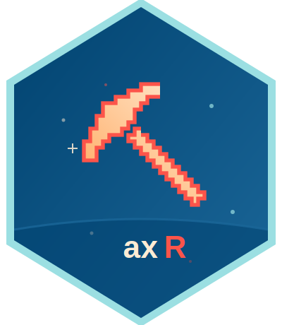

# ⛏️ axR

**Serial communication and data retrieval for Axivity AX3/AX6 accelerometer devices.**
[](./LICENSE)
[](https://www.r-project.org/)
[](https://lifecycle.r-lib.org/articles/stages.html)

---



## 📖 What is axR?

`axR` talks to Axivity AX3/AX6 accelerometers over USB: discovering connected
devices, sending configuration and reset commands over the device's serial
(CDC/COM port) interface, and retrieving recorded `.cwa` files off the
device's USB mass storage volume.

`axR` is deliberately a "dumb pipe" — it doesn't know anything about `.cwa`
file structure. Parsing recorded data is left to downstream packages such as
[mrpheus](https://github.com/circadia-bio/mrpheus) or
[zeitR](https://github.com/circadia-bio/zeitR).

> **Status:** early scaffold. Function signatures and docs are drafted;
> the underlying serial I/O is not yet implemented pending protocol design
> (baud rate, timeouts, device matching, exact command set).

## ✨ Planned features

- 🔍 Device discovery — find connected Axivity devices by matching serial
  port VID/PID against the known Axivity signature
- ⚙️ Configuration & reset — send commands from the documented Open Movement
  serial protocol (e.g. `FORMAT`, `FORMAT W`, RTC set)
- 📥 Data download — copy recorded `.cwa` files off the device's USB mass
  storage volume

## 🗂️ Project Structure

```
axR/
├── R/
│   ├── axR-package.R   # package-level documentation
│   ├── serial.R        # discover / open / close / send_command / reset
│   └── download.R      # axivity_download()
├── src/
│   ├── serial.cpp       # POSIX termios.h / Windows kernel32 scaffold
│   ├── Makevars         # POSIX build config
│   └── Makevars.win     # Windows build config
├── tests/testthat/
├── man/figures/logo.svg
├── DESCRIPTION
└── NEWS.md
```

## 🚀 Getting Started

### Prerequisites

- R (>= 4.1.0)
- Rcpp
- A C/C++ toolchain (Xcode CLT on macOS, Rtools44 on Windows)

### Installation

```r
# not yet on r-universe — install from source once functional:
remotes::install_github("circadia-bio/axR")
```

## 📦 Dependencies

| Package | Version   | Purpose                          |
|---------|-----------|-----------------------------------|
| Rcpp    | >= 1.0.0  | Compiled serial I/O (termios/kernel32) |

## 👥 Authors

| Role | Name | Affiliation |
|------|------|--------------|
| Author, maintainer | Lucas França | Circadia Lab, Northumbria University |

## 🤝 Related Tools

- 🧪 [**zeitR**](https://github.com/circadia-bio/zeitR) — wrist actigraphy analysis and circadian metrics
- 🧪 [**mrpheus**](https://github.com/circadia-bio/mrpheus) — raw physiological signal analysis (PSG/EEG)
- 🧪 [**syncR**](https://github.com/circadia-bio/syncR) — ecosystem integrator, pulls data into a unified participant database
- 🔬 [**circadia-bio**](https://github.com/circadia-bio) — the Circadia Lab GitHub organisation

## 📄 Licence

Released under the [MIT License](./LICENSE).

Copyright © Lucas França, 2026
